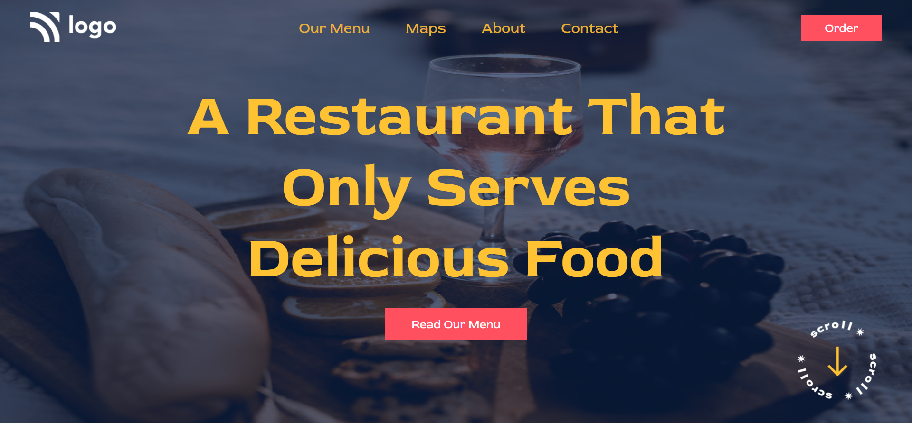

## PROJECT NAME: Food Restaurant Home Page

### **💻TECH STACK USED IN THIS PROJECT:** 
- 
- 

### **🛠WHAT I HAVE LEARNT IN THIS PROJECT:** 
- Setting of background image and background color
- Setting the line-height
- Adding different fonts from the Google Fonts
- designing Buttons 
- CSS Flex-box
- Paddings and Margins
- Absolute Positioning
- hover effect
- CSS Selectors

### **⌛TIME TAKEN TO COMPLETE THIS PROJECT:** 
- I have taken 1 hour to complete this project.

### **👀HOW MY PROJECT LOOKS LIKE:**

### 💻It works only in **LAPTOP**(Not Responsive).

### **🚀LIVE LINK:**
-  This project is hosted on **Netlify**.You can Check it live using below link: 
-  [Project Live Link !](https://631ad3a3fffa576c089989d3--ornate-griffin-7c4642.netlify.app/)

